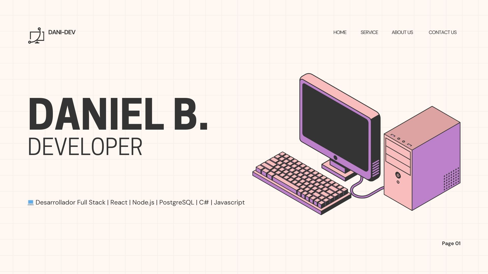
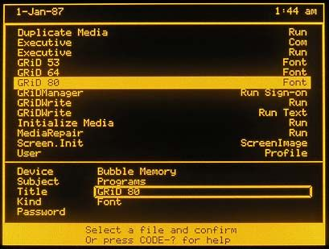

<h1 align="center">Hi 👋, I'm Daniel</h1>
<h3 align="center">A passionate Programmer from Chile</h3>

<!--   -->
<!--   -->

  

  

 

- 🔭 I’m currently working on web development technologies like JavaScript, React , c#, .Net.

- 🌱 I’m currently learning about Frontend and Backend technologies 

- 💬 Ask me about **Java, Python, React and NodeJS**

- 📫 How to reach me *daniel.alexis.b1@gmail.com**

- ⚡ Fun fact **1vs1??**

 
<h3 align="left">Connect with me:</h3>

 

<h3 align="left">Languages and Tools:</h3>

- Backend

  

- Frontend

  

- Database

  

- Cloud Servers

  

- Tools

  

 

 <em><b>I love connecting with different people</b> so if you want to say <b>hi, I'll be happy to meet you more!</b> :)</em>

